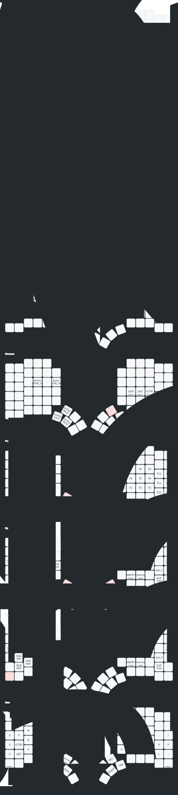

# Glophite layout for MoErgo's Glove80

This is my layout for MoErgo's Glove80 board using 34 keys.
It uses [Graphite layout](https://github.com/rdavison/graphite-layout) with swapped QX bigram and punctuation adjusted to my liking.

[View it in MoErgo's layout editor](https://my.glove80.com/#/layout/user/0334621a-25bc-4dc8-9cf7-392f2f3079ae)

