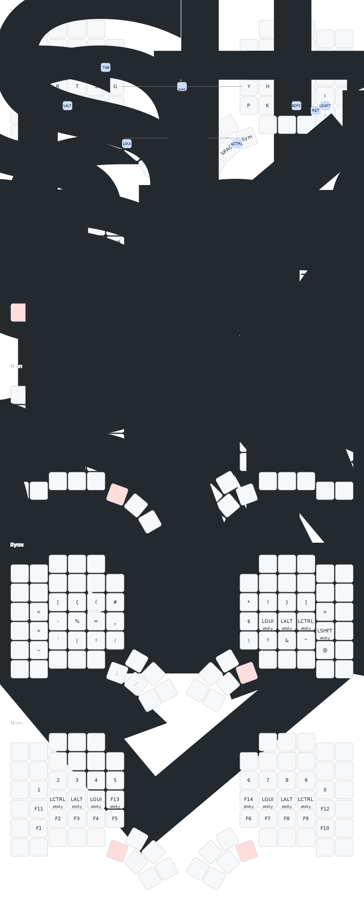

# Glophite layout for MoErgo's Glove80

This is my layout for MoErgo's Glove80 board using 34 keys.
It uses [Graphite layout](https://github.com/rdavison/graphite-layout) with swapped QX and PK bigrams.

[View it in MoErgo's layout editor](https://my.glove80.com/#/layout/user/970282ba-4ec1-4057-bbb3-a35c8b2f7c84)

